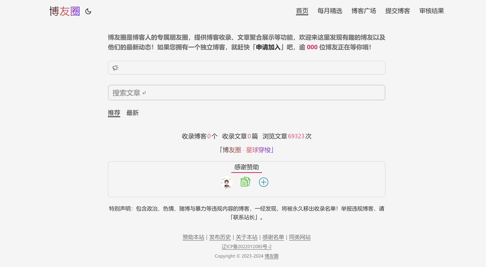
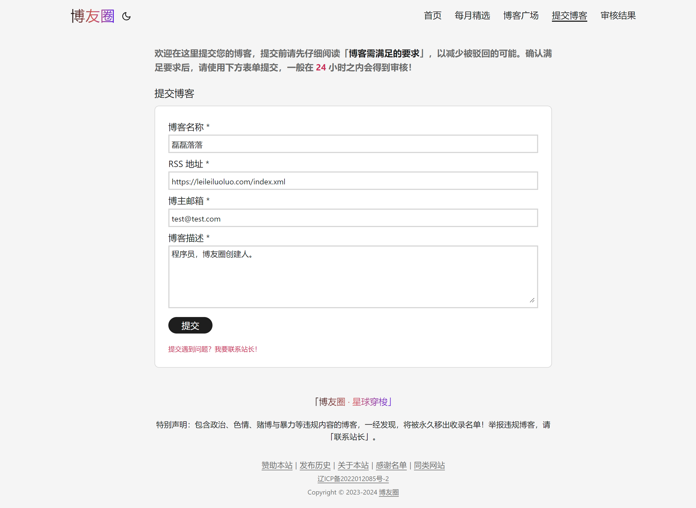
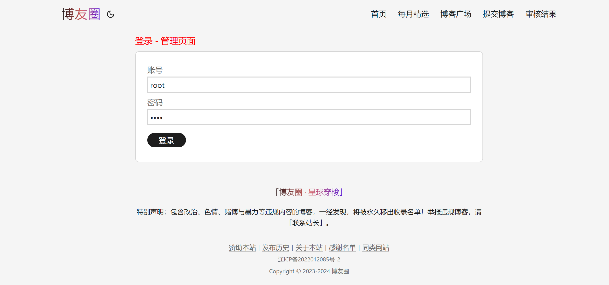
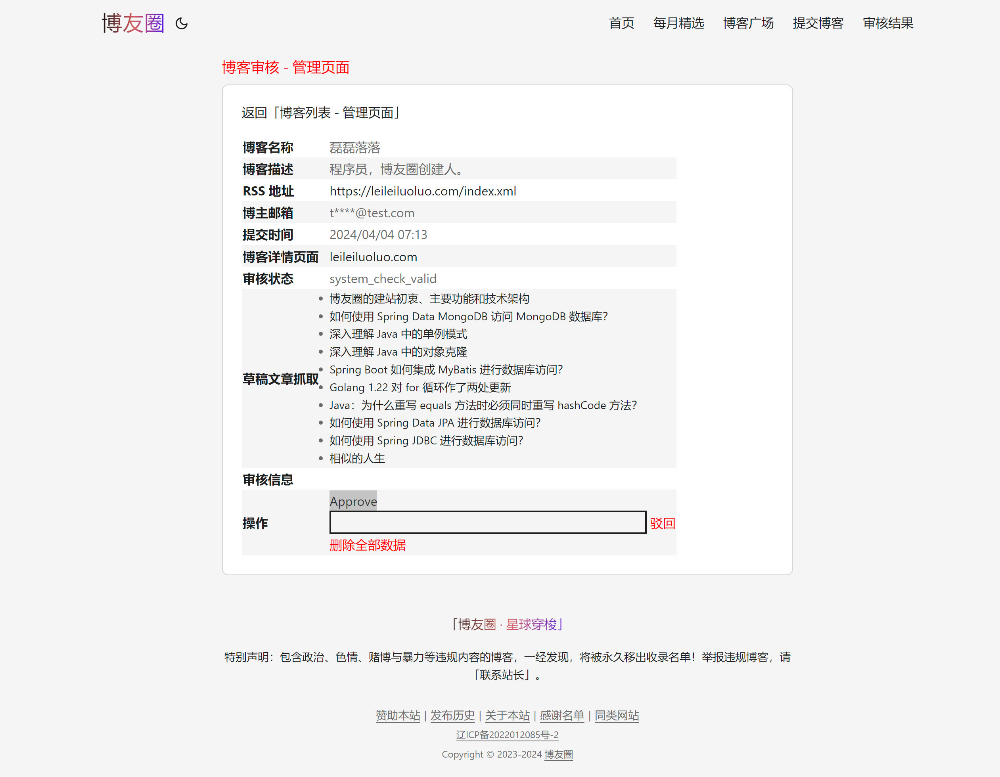
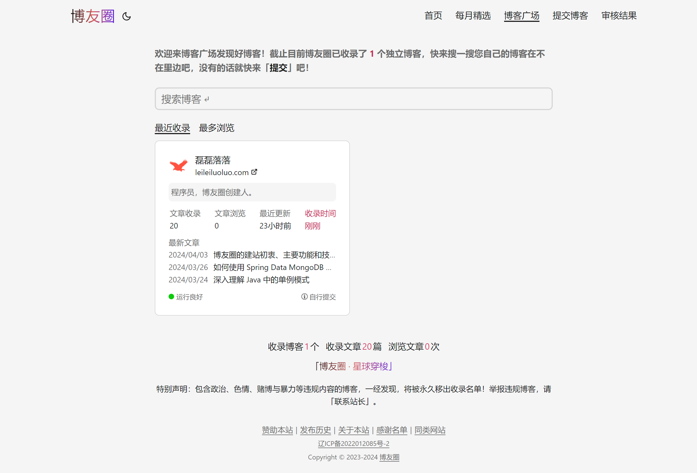

# 博友圈网站源码

## 博友圈介绍

博友圈（[www.boyouquan.com](https://www.boyouquan.com)）成立于 2023 年，是博客人的专属朋友圈，提供博客收录、文章聚合展示、星球穿梭等功能。

若想了解博友圈的建站初衷、主要功能和技术架构详情，请参看站长的「[这篇博客文章](https://leileiluoluo.com/posts/boyouquan-introduction.html)」。

## 工程介绍

博友圈应用程序是一个使用 Maven 管理的 Java 工程，集前后台于一体，使用了 Spring Boot + Thymeleaf + MyBatis 技术。其中，Spring Boot 是工程所使用的总框架，其 SpringMVC 模块负责请求处理和依赖注入，Thymeleaf 模块负责模板渲染，MyBatis 模块负责数据库访问。此外，该应用程序使用的数据库是 MariaDB。

## 应用程序架构

博友圈应用程序架构如下图所示，自上而下使用了经典的三层架构：即控制器层（Controller Layer）、业务逻辑层（Service
Layer）、数据访问层（DAO Layer）。


- 控制器层包含一组 SpringMVC 控制器，负责请求的接收、参数校验、服务调用和结果的返回；
- 业务逻辑层包含一组服务，负责核心业务逻辑处理；
- 数据访问层包含一组 MyBatis 接口，负责与数据库的交互。

此外，附加的调度器层（Scheduler Layer）和帮手层（Helper Layer）则分别包含了一组定时任务和辅助工具类。

## 程序设置与启动

### 依赖项

本工程依赖的 Java 与 MariaDB 版本如下：

- Java 17+
- MariaDB 10.5+

### 数据库

本工程已将所有用到的 MySQL 建库与建表语句置于 `sql/ddl` 目录下。

首先，在您本地安装的 MariaDB 上执行如下建库语句：

[./sql/ddl/database.sql](./sql/ddl/database.sql)

然后，在建好的数据库上执行 [./sql/ddl/](./sql/ddl/) 目录下除 `database.sql` 之外的所有 SQL 文件中的语句。

最后，需要对 `user` 表执行一条插入一句，以设置管理员账号：

```sql
-- root/root
INSERT INTO `user` (`username`, `md5password`, `role`, `deleted`)
  VALUES ('root', md5('root'), 'admin', false);
```

### 编译与运行

在工程根目录使用如下 Maven 命令进行打包：

```shell
./mvnw clean package
```

打包完成后，使用如下命令设置环境变量，并运行：

```shell
export DATABASE_URL=jdbc:mysql://localhost:3306/boyouquan
export DATABASE_USER=root
export DATABASE_PASSWORD=root
export EMAIL_ENABLE=false

java -jar ./target/boyouquan-1.0.jar
```

启动成功后，访问 [http://localhost:8080](http://localhost:8080) 即可看到一个空白的首页：



然后点击「提交博客」，录入信息，提交第一个博客即可：



打开博客申请管理页面 [http://localhost:8080/admin/blog-requests](http://localhost:8080/admin/blog-requests)
，输入 `root/root` 并登录：



可以看到一条申请，点击博客名称查看申请详情，然后点击下方的 Approve 即可：



这样，在「博客广场」即可看到这个博客了：


